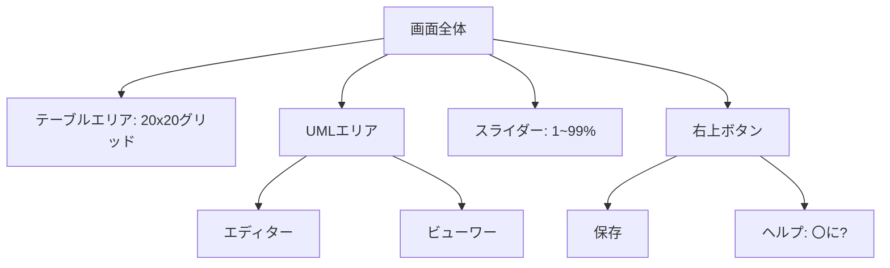

# テーブル + UML エディター Webアプリ仕様書

## 概要

テーブルエディターとUMLエディター／ビューワーを統合したWebアプリ。UIは画面をスライダーで分割し、テーブル領域とUML領域の表示比率を調整可能にする。開発者の会議中のメモとフローチャート作成を効率化することを目的とする。

## 技術スタック

- フロントエンド: TypeScript + Svelte
- 状態管理: Svelte store
- UML描画: Mermaid.js
- ビルド: SvelteKit（静的出力）

## 画面構成



- テーブルエリアとUMLエリア: スライダー（\<input type="range">）で分割比率を1〜99%で調整可能。
- UMLエリア: 左右分割（左: エディター、右: ビューワー）。右上に三角ボタンでモード切替（エディター＋ビューワー ↔ ビューワーのみ）。
- 右上ボタン: 「保存」と「ヘルプ（〇に?）」を配置。ヘルプはオーバーレイで操作説明＋サンプル表示。

## 機能一覧

|機能|優先度|備考|
|---|---|---|
|テーブルセル編集|高|20×20固定グリッド|
|UMLテキスト入力|高|Mermaid DSLで記述|
|UML描画（Mermaid）|高|リアルタイム（1秒debounce）|
|分割スライダー|高|0〜100%で調整|
|UMLモード切替|高|三角ボタンで切り替え|
|ファイル保存（YAML）|高|トリミングして最小限保存、DL形式|
|ファイル読み込み|高|ドラッグ＆ドロップで既存YAMLを開く|
|ヘルプ表示|中|オーバーレイで操作説明＋サンプル|
|セルの追加／削除|低|将来的に終端で動的追加を検討|

## データ構造（TypeScript）

```ts
type Cell = {
  value: string;
};

type Sheet = Cell[][];

type UmlEditorState = {
  mode: 'editor-viewer' | 'viewer-only';
  dsl: string;
};

type AppState = {
  テーブル: Sheet;         // 20×20固定、保存時はトリミング
  uml: UmlEditorState;
  splitRatio: number;   // 1〜99
};
```

## 保存フォーマット（YAML）

### 例: テーブルにC3:E5にデータ、UMLにフローチャート

```yaml
テーブル:
  "A,B,C,D,E":
    - ["", "", "", "", ""]
    - ["", "", "", "", ""]
    - ["", "", "1", "2", "3"]
    - ["", "", "4", "5", "6"]
    - ["", "", "7", "8", "9"]
uml: |
  flowchart TD
    A --> B
view:
  splitRatio: 30
  umlMode: "editor-viewer"
```

- テーブル: 使用済み範囲（例: 5×5）をトリミングして保存。空セルは""。
- UML: Mermaid DSLを文字列で保存。
- View: レイアウト情報を保持。

## 詳細仕様

### テーブルエリア

- 初期は20×20固定。将来的にスクロール終端で動的に行／列追加を検討。
- 保存時は最大行・列を計算し、空行／空列をトリミング。

### UMLエリア

- レイアウト: 左右分割（エディター左、ビューワー右）。
- モード切替: 右上三角ボタン（ドッグイヤー風）。
- 描画: DSL入力時に1秒debounceでリアルタイム更新。開発中に調整可能。

### 保存／読み込み

- 保存: YAML形式でトリミング後、ブラウザDL（\<a download>）。
- 読み込み: ドラッグ＆ドロップでYAMLをAppStateに反映。エラーはアラート表示。

### ヘルプ機能

- UI: 右上に「〇に?」ボタン。押すとオーバーレイ表示（ボタンが「戻る」に変化）。
- 内容: 上部に基本操作説明、下部にサンプル設定（例: splitRatio: 30, umlMode: "editor-viewer"）。
- サンプルは表示のみで、ユーザーが編集開始まで保持。

## 開発方針

- スコープ: 会議中のメモ＆フローチャート作成に特化。モバイル対応は後回し。
- 拡張性: Mermaidの限界時は\<iframe>で外部ツール連携を検討。
- ビルド: SvelteKitで静的アプリ化（サーバー機能不要）。

## ユースケース

- ターゲット: 開発者。
- シーン: 会議中にテーブルでメモを取りつつ、フローチャートを即座に作成。
